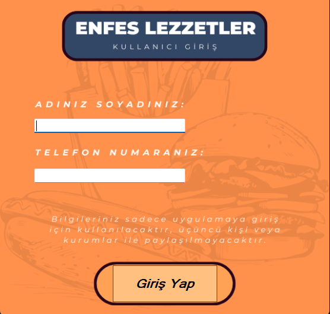
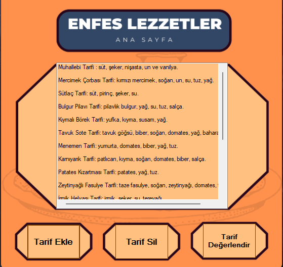

# 🍽️ Yemek Tarifi Uygulaması

Bu proje, **C# Windows Forms** kullanılarak geliştirilmiş bir **Yemek Tarifi Uygulaması** uygulamasıdır. Kullanıcılar, sisteme giriş yaparak yemek tariflerini görüntüleyebilir ve kendi tariflerini ekleyebilir. Proje eğitim amaçlıdır.

## 🧩 Özellikler

- Yemek tariflerini listeleme
- Tarifi görüntüleme
- Kendi tariflerini ekleme
- Basit ve kullanıcı dostu arayüz

## 🛠️ Kullanılan Teknolojiler

- C# (Windows Forms)
- .NET Framework
- Visual Studio
- (Opsiyonel: JSON, XML ya da SQL Server ile veri saklama)

## 🖼️ Uygulama İçi Ekran Görüntüleri

